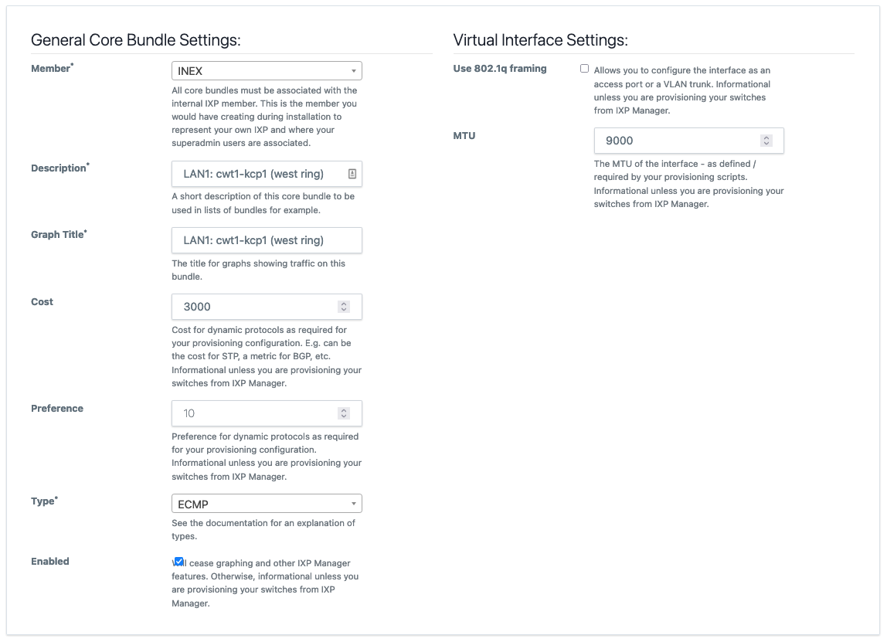
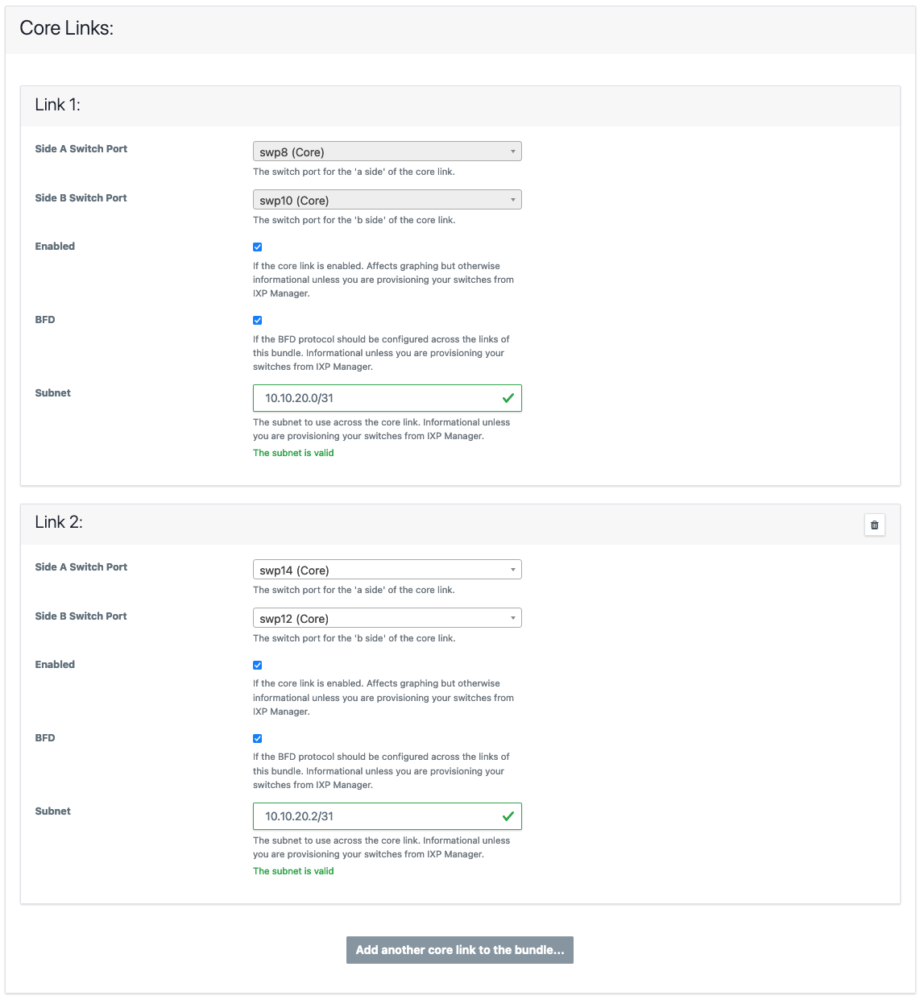

# Core Bundles

A *core bundle* is a link between the IXP's own switches. These are often referred to as *trunks*, *interswitch links (ISLs)*, *core links*, etc. **IXP Manager** has a number of features to support these since v6 was released.

Before continuing with this document, it is critical you have read and understand how IXP Manager represents normal member connections - please read the [Customer Connections](../usage/interfaces.md) page before proceeding as the rest of this document assumes that foundational knowledge.

Within IXP Manager, a *core bundle* represents a link(s) between two switches. This bundle may have one or more links and it may be one of three types:

1. A layer 2 LACP link *(L2-LAG)*. Where your exchange has more than two switches, a protocol such as spanning tree would operate across these links to prevent loops.

    If you are running just two switches with a single link between them, this is also the option you would choose. We'd typically recommend a protocol such as LACP or UDLD runs across even single links to detect unidirectional link errors.

2. A layer 3 LAG *(L3-LAG)* is for one or more aggregated links between a switch when using a routed underlay such as MPLS / VPLS / VXLAN. Each end of the link would have an IP address and participate in a routing core network.

3. *ECMP* is similar to L3-LAG above each each individual link in the *core bundle* has its own IP addressing and traffic distribution across the links is handled via equal-cost multi-path (ECMP) routing.

???+ important "INEX has been using the core bundles feature internally for some time without issue. We use ECMP extensively and L2-LAGs to a lesser extent. This all ties into our automation. L3-LAGs are mostly untested by us so please open bug reports on GitHub if there are any issues."


Some of the features that core bundles provide and enable include:

* Creation and management of core bundles.
* Graphing of core bundles.
* Wizard to enable the creation of complex core bundles.
* Enables automation of switch configuration. INEX has published a number of templates:
  * Arista EOS: [interface configuration](https://github.com/inex/ixp-manager-provisioning/blob/master/napalm/templates/arista-eos/configure_core_interfaces.j2) and [BGP configuration](https://github.com/inex/ixp-manager-provisioning/blob/master/napalm/templates/arista-eos/configure_bgp.j2) suitable for VXLAN and ECMP.
  * Cumulus: [interface configurations](https://github.com/inex/ixp-manager-provisioning/tree/master/saltstack/inex/states/cumulus/etc/network/interfaces.d) with [FRR (for BGP)](https://github.com/inex/ixp-manager-provisioning/tree/master/saltstack/inex/states/cumulus/etc/frr).
* Integration with weather map software (e.g. the configuration for [these weathermaps](https://www.inex.ie/technical/network-weathermap/)) are dynamically generated.
* Nagios checks for core bundle monitoring and alerting.


## Database Representation

To fully understand IXP Managers implementation of core bundles, it is important to have an awareness of the database representation of them. This is why reading the [customer connections](../usage/interfaces.md) page is important - core bundles have been designed to fit into the existing database representation:


As you'll note, we still have a virtual interface (VI) as the syntactic sugar to represent a link where:

* Each VI is owned by a customer. In the case of core bundles, the *customer* will be your IXP's internal customer record.
* VIs contain one or more physical interfaces (PIs). As you'll note from the second representation below, each PI has a one-to-one relationship with a switch port (SP).

What's new is we've added a new element of syntactic sugar - the core bundle (CB) - and this is used to group the two ends of the link(s) between switches together.


* Each CB has one or more pairs of core links (CLs).
* Each core link represents a physical connection (e.g. the fibre cable) from a port on one switch to the port on another switch.
* Each core link has two core interfaces (CIs) - the 'a side' interface and the 'b side' interface.
  * Which switch is the 'a side' doesn't matter as long as it is consistent for each core link in a core bundle. I.e. if a core bundle has four links, then the same switch must be the 'a side' for each core interface.
* A core interface (CI) is a simple one-to-one mapping to a physical interface. From there, the existing schema takes over and a physical interface connects to a switch port which in turn is attached to a switch.

> The above may seem quite complex but it works well in practice. Most importantly, IXP Manager guides you through most of the complexity when setting up and managing core bundles. However, it's still important to have a grasp of the above as the user interface does reflect the underlying database schema.


## Creating a Core Bundle

Core bundles can be added like any another object in IXP Manager: find *Core Bundles* under *IXP Admin Actions* on the left hand side menu and then, when you are on the core bundles page, select the `[+]` add button on the top right of the page.

Adding a core bundle is presented with *wizard-type* functionality. As with most IXP Manager pages, there is extensive context-based help available by clicking the help button at the end of the form.

There's a number of elements to adding a core bundle and we'll take them individually here using an ECMP bundle as an example.


### General Settings



The context help shown in the image explains each element's requirements quite well.

You will notice that we often say *informational unless you are provisioning your switches from IXP Manager*. This is because many of these settings have no impact with IXP Manager or associated functions such as graphing. The value of entering this information won't be appreciated unless you are provisioning switches via IXP Manager using something such as Napalm.  

Manually provisioning a core bundle with 8 x 10Gb ECMP links for a VXLAN underlay requires 16 interface configurations with consistent and correct IP addressing, MTU, BFD, etc. Add to that the 16 BGP neighbor configurations required. This does not scale beyond a handful of switches. We'd argue it barely scales to two switches. Especially when you then need to change the cost / preference settings.

Using IXP Manager, INEX can edit the cost of a core bundle and push it out through our SaltStack + Napalm configuration in a quick and error free manner.

It should also be recognised that the specific meaning of *cost*, *preference*, *STP*, etc. do not need to be taken literally - use them as appropriate for your network design and technology. For example, INEX uses *cost* for BGP metrics.

Lastly, some elements appear in general settings as they need to be consistent across all links in a core bundle - for example the MTU.


### Common Link Settings


Again, the context help shown in the image explains each element's requirements quite well. In addition to those, please note:

* MLAG / multi-chassis LAGs are not supported by IXP Manager (or considered a useful feature at an IXP by the author). There for the 'a side' and 'b side' switches for a bundle of core links need to be consistent.
* Similarly, the speed / duplex of all links within a bundle must be the same.


### Core Links



The final section requires you add one or more core links and select the 'a side' and 'b side' ports for each link added.

Note that some elements are core bundle type specific - e.g. as this is an ECMP core bundle, the subnet and BFD can be configured on a per link basis. For a L3-LAG, these are configured as part of the general settings.

There are a number of features to assist with adding large bundles (e.g. when we developed this using INEX as a test case, and before the widespread deployment of 100Gb WDM kit, 8 x 10Gb bundles were not uncommon). When you click *Add another core link to the bundle...*:

* The next available switch port on each switch will be pre-selected. (Rationale: most people will prefer to run bundles on consecutive ports where possible.)
* The next subnet will be calculated and populated. E.g. if you chose `10.10.20.0/30` for link 1, then `10.10.20.4/30` will be populated for link 2, and so on.

    We have discussed this with some IXPs who use an addressing scheme where they try and embed information in the IP address such as facility or switch. We always advise that you treat an IP address as a 32-bit unique identifier and nothing else. If you choose a more complex addressing scheme, you can of course override IXP Manager's assistance here.

    Your provisioning system will be responsible for picking the IP address for each side from `10.10.20.4/30`. We recommend (and implement) a system such that the lowest usable address is assigned to the 'a side' and the next usable address is assigned to the 'b side'. For illustration:

    | Subnet          | A Side       | B Side       |
    |-----------------|--------------|--------------|
    | `10.10.20.0/31` | `10.10.20.0` | `10.10.20.1` |
    | `10.10.20.0/30` | `10.10.20.1` | `10.10.20.2` |
    | `10.10.20.0/24` | `10.10.20.1` | `10.10.20.2` |


## Graphing

Core bundles make graphing inter-switch links really easy - in fact, so long as you already have MRTG graphing configured, you just need to add the bundle, allow MRTG configuration to update and the graphs will appear in the statistics menu.

In fact, you can see [a live example from INEX here](https://www.inex.ie/ixp/statistics/core-bundle/33?category=bits&side=a). If this link yields a 404, it will mean we've since mothballed that specific link. Just browse to the *Statistics* menu and select *Inter-Switch / PoP Graphs* for another.

You'll note:

* on the top right is some detail on the graph. At the time of writing, the above link produced *ECMP, swi1-cwt1-4 - swi1-cwt2-3, 4 x 100 Gbits = 400 Gbits* - i.e. the type, the 'a' and 'b switch', the number of ports and their speed, and the total speed available.
* unlike any other graphs in IXP Manager, the IX owns both ends of this link. As such, you can also chose to view the graph from the 'a side' or the 'b side'.
* By default, bits and packets are available publicly. Errors and discards are available to the IX operator (superadmins).


## Nagios Monitoring

There is an [API endpoint](api.md) for superadmins to get the status of core bundles:

```
/api/v4/switch/{switchid}/core-bundles-status
```

where `{switchid}` is the database ID of the switch.

A sample of the JSON output is:

```json
{
  "status": true,
  "switchname": "swi1-cwt1-4",
  "msgs": [
    "swi1-cwt1-4 - swi1-cwt1-1 OK - 1\/1 links up",
    "swi1-cwt1-4 - swi1-cwt1-2 OK - 1\/1 links up",
    "swi1-cwt1-4 - swi1-cwt2-1 OK - 1\/1 links up",
    "swi1-cwt1-3 - swi1-cwt1-4 OK - 3\/3 links up",
    "swi1-cwt1-4 - swi1-cwt2-3 OK - 4\/4 links up"
  ]
}
```

If any individual link has failed, `status` will return `false` and an appropriate message will be provided:

```
"ISSUE: swi1-cwt1-4 - swi1-cwt1-1 has 0\/1 links up"
```

Individually disabled core links (via the core bundle UI) will not trigger an alert. If an entire core bundle is disabled in the UI it will be listed as follows:

```
"Ignoring swi1-cwt1-4 - swi1-cwt1-1 as core bundle disabled"
```


As you can see, it returns a `msgs[]` element for each core bundle indicating the number of core links up.
