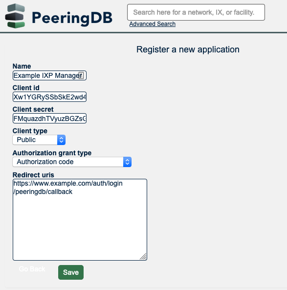
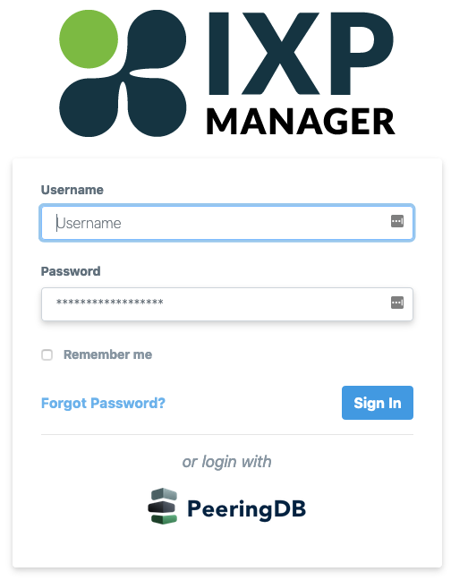

# PeeringDB - OAuth

IXP Manager can authenticate users via their PeeringDB account and affiliations (from V5.2.0). This is hugely beneficial for your customers who are members of multiple IXPs which use IXP Manager - it means they only need their PeeringDB account to access their portal at each of those IXs.

**NB:** this feature is not set up by default as it requires some configuration on both PeeringDB and your IXP Manager installation.

### Security

**Is there a security risk?**

Well, we at INEX do not think so and we have developed and enabled this feature for our members.

By enabling PeeringDB OAuth, you are creating a path that delegates authentication and authorization of users on your platform. This is not a decision that was rushed into. PeeringDB has become the industry standard database for network operators and the PeeringDB team take the job of assessing whether someone should be affiliated with a network seriously.

We at INEX also discussed this functionality with a wide variety of people in our industry and the opinion was overwhelmingly in favor with no known dissenters.

Lastly, we have developed this in a security-conscious way. New users get read-only access by default. All information from PeeringDB is validated and a number of other confirmatory steps are taken. You can read all about this in the [OAuth User Creation](./peeringdb-oauth.md#oauth-user-creation) section below.


## Configuring PeeringDB for OAuth

There are two steps to configuring OAuth for PeeringDB - first set it up on PeeringDB and then, using the tokens generated there, configure IXP Manager.

### Configuring PeeringDB

The first step is to create your IXP Manager OAuth *application* through your PeeringDB account:

1. Log into your PeeringDB account at https://www.peeringdb.com/login
2. Access the OAuth applications page by either:
    * browsing directly to: https://www.peeringdb.com/oauth2/applications/ after logging in; or
    * access your profile by clicking on your username on the top right and then click on *Manage OAuth Applications* on the bottom left.
3. Click *[New Application]*.
4. Complete the form as follows:
    * Set the name (e.g. *IXP Manager*).
    * Record the client ID (needed for IXP Manager's configuration).
    * Record the client secret (needed for IXP Manager's configuration).
    * Set *Client type* to *Public*.
    * Set *Authorization grant type* to *Authorization code*.
    * For *Redirect urls*, you need to provide the fully qualified path to the `/auth/login/peeringdb/callback` action on your IXP Manager installation. For example, if the base URL of your IXP Manager installation is `https://www.example.com` then set redirect URL to `https://www.example.com/auth/login/peeringdb/callback`. *Note that for OAuth, it is mandatory to use https:// (encryption).*
5. Click *[Save]*.

Here is a sample form on PeeringDB:



## Configuring IXP Manager

To enable OAuth with PeeringDB on IXP Manager, set the following options in your `.env` file:

```
AUTH_PEERINGDB_ENABLED=true

PEERINGDB_OAUTH_CLIENT_ID="xxx"
PEERINGDB_OAUTH_CLIENT_SECRET="xxx"
PEERINGDB_OAUTH_REDIRECT="https://www.example.com/auth/login/peeringdb/callback"
```

while replacing the configuration values for the those from the PeeringDB set-up above.

Once this is complete, you'll find a new option on IXP Manager's login form:



By default, new users are created on IXP Manager as read-only *customer users*. You can change this to read-write *customer admin* users by additionally setting the following option:

```
AUTH_PEERINGDB_PRIVS=2
```


## OAuth User Creation

When IXP Manager receives an OAuth login request from PeeringDB, it goes through a number of validation, creation and deletion steps:

1. Ensure there is a valid and properly formatted user data object from PeeringDB.
2. Ensure that both the PeeringDB user account and the PeeringDB email address is verified.
3. Validate the set of affiliated ASNs from PeeringDB and ensure at least one matching network configured on IXP Manager.
4. Load or create a user on IXP Manager with a matching PeeringDB user ID. Whether the user already existed or needs to be created, the name and email are updated to match PeeringDB. If the user is to be created then:
    * username is set from the PeeringDB provided name (or `unknownpdbuser`) using `s/[^a-z0-9\._\-]/./` with an incrementing integer concatenated as necessary for uniqueness.
    * database column `user.peeringdb_id` set to PeeringDB's user ID.
    * cryptographically secure random password set (user not provided with this - they will need to do a password reset to set their own password if so desired).
    * database column `user.creator` set to `OAuth-PeeringDB`.
5. Iterate through the user's current affiliated customers on IXP Manager and remove *any that were previously added by the PeeringDB OAuth process* but are no longer in PeeringDB's affiliated networks list.
6. Iterate through PeeringDB's affiliated networks list and identify those that are not already linked in IXP Manager - the potential new networks list.
7. For each network in the potential new networks list, affiliate it with the user if:
    * the network exists on IXP Manager;
    * the network is a peering network (customer type full or pro-bono);
    * the network state in IXP Manager is *Normal*; and
    * the network is active (not cancelled).
8. If at the end of this process, the user is left with no affiliated networks, the user is deleted.


## Identifying OAuth Users

If `AUTH_PEERINGDB_ENABLED` is enabled in your `.env`, you will see a column called *OAuth* in the *Users* list table (accessed via the left hand side menu). This will indicate if the user was created by OAuth (Y) or not (N).

When viewing a user's details (<em>eye button</em> on the users list), it will show how the user was created and also how the user was affiliated with a particular customer. The same is also shown when editing users.

## Historical Notes

PeeringDB OAuth with IXP Manager as an idea dates from early 2017 when Job Snijders proposed it in GitHub issue [peeringdb/peeringdb#131](https://github.com/peeringdb/peeringdb/issues/131). We recognized the benefits immediately and opened a parallel ticket at [inex/IXP-Manager#322](https://github.com/inex/IXP-Manager/issues/322). The background discussions at this point were that PeeringDB would be prepared to invest developer time if IXP Manager committed to implementing it. We both did.

PeeringDB's [OAuth documenation can be found here](https://docs.peeringdb.com/oauth/).

As part of the development process, we wrote a provider for the [Laravel Socialite](https://laravel.com/docs/6.0/socialite) package which was merged into that package via the [SocialiteProviders/Providers#310](https://github.com/SocialiteProviders/Providers/pull/310) pull request.

## Development Notes

Testing in development needs to be setup following the instructions above. While PeeringDB has a [beta site](https://beta.peeringdb.com/), the actual OAuth URL is hard coded into Socialite. You can test against production or edit the two URLs in this file: `data/SocialiteProviders/src/PeeringDB/Provider.php`.

For local testing, you'll need both SSL and a way for PeeringDB to redirect back to you. `valet share` from [Laravel Valet](https://laravel.com/docs/6.0/valet) is perfect for this.
